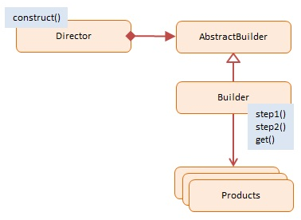
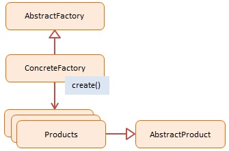
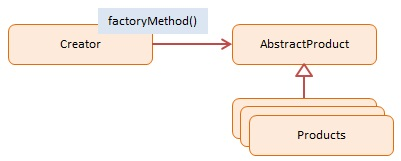

[[<<<]](README.md)

# Builder vs Abstract Factory vs Factory Method
## Builder
**Definition**: Separate the construction of a complex object from its representation so that the same construction process can create different representations.

**Summary**: The Builder pattern allows a client to construct a complex object by specifying the type and content only. Construction details are hidden from the client entirely.

The most common motivation for using Builder is to simplify client code that creates complex objects. The client can still direct the steps taken by the Builder without knowing how the actual work is accomplished. Builders frequently encapsulate construction of Composite objects (another GoF design pattern) because the procedures involved are often repetitive and complex.

Usually it is the last step that returns the newly created object which makes it easy for a Builder to participate in fluent interfaces in which multiple method calls, separated by dot operators, are chained together (note: fluent interfaces are implementation of the Chaining Pattern as presented in the Modern patterns section).



The objects participating in this pattern are: 
- Director -- In sample code: Shop
  - constructs products by using the Builder's multistep interface
- <span style="color: #BBB">Builder -- not used in JavaScript</span>
  - <span style="color: #BBB">declares a multistep interface for creating a complex product</span>
- ConcreteBuilder -- In sample code: CarBuilder, TruckBuilder
  - implements the multistep Builder interface
  - maintains the product through the assembly process
  - offers the ability to retrieve the newly created product
- Products -- In sample code: Car, Truck
  - represents the complex objects being assembled

The AbstractBuilder is not used because JavaScript does not support abstract classes. However, the different Builders must implement the same multistep interface for the Director to be able to step through the assembly process

The JavaScript code has a Shop (the Director) and two builder objects: CarBuilder and TruckBuilder. The Shop's construct method accepts a Builder instance which it then takes through a series of assembly steps: step1 and step2. The Builder's get method returns the newly assembled products (Car objects and Truck objects).

The client has control over the actual object construction process by offering different builders to the Shop.

The log function is a helper which collects and displays results.

``` javascript
function Shop() {
    this.construct = function(builder) {
        builder.step1();
        builder.step2();
        return builder.get();
    }
}
 
function CarBuilder() {
    this.car = null;
 
    this.step1 = function() {
        this.car = new Car();
    };
 
    this.step2 = function() {
        this.car.addParts();
    };
 
    this.get = function() {
        return this.car;
    };
}
 
function TruckBuilder() {
    this.truck = null;
 
    this.step1 = function() {
        this.truck = new Truck();
    };
 
    this.step2 = function() {
        this.truck.addParts();
    };
 
    this.get = function() {
        return this.truck;
    };
}
 
function Car() {
    this.doors = 0;
 
    this.addParts = function() {
        this.doors = 4;
    };
 
    this.say = function() {
        log.add("I am a " + this.doors + "-door car");
    };
}
 
function Truck() {
    this.doors = 0;
 
    this.addParts = function() {
        this.doors = 2;
    };
 
    this.say = function() {
        log.add("I am a " + this.doors + "-door truck");
    };
}
 
// log helper
var log = (function () {
    var log = "";
    return {
        add: function (msg) { log += msg + "\n"; },
        show: function () { alert(log); log = ""; }
    }
})();
 
function run() {
    var shop = new Shop();
    var carBuilder = new CarBuilder();
    var truckBuilder = new TruckBuilder();
    var car = shop.construct(carBuilder);
    var truck = shop.construct(truckBuilder);
 
    car.say();
    truck.say();
 
    log.show();
}
```

[dofactory: builder](http://www.dofactory.com/javascript/builder-design-pattern)

[[UP]](#)

## Abstract Factory
**Definition**: Provide an interface for creating families of related or dependent objects without specifying their concrete classes.

**Summary**: An Abstract Factory creates objects that are related by a common theme. In object-oriented programming a Factory is an object that creates other objects. An Abstract Factory has abstracted out a theme which is shared by the newly created objects.

Suppose we have two Abstract Factories whose task it is to create page controls, such as, buttons, textboxes, radio buttons, and listboxes. One is the Light Factory which creates controls that are white and the other the Dark Factory which creates controls that are black. Both Factories creates the same types of controls, but they differ in color, which is their common theme. This is an implementation of the Abstract Factory pattern.

Over time the Abstract Factory and Factory Method patterns have merged into a more general pattern called Factory. A Factory is simply an object that creates other objects.

You may be wondering why you would want to leave the responsibility of the construction of objects to others rather than simply calling a constructor function with the new keyword directly. The reason is that that constructor functions are limited in their control over the overall creation process and sometimes you will need to hand over control to a factory that has broader knowledge.

This includes scenarios in which the creation process involves object caching, sharing or re-using of objects, complex logic, or applications that maintain object and type counts, and objects that interact with different resources or devices. If your application needs more control over the object creation process, consider using a Factory.



The objects participating in this pattern are: 

- <span style="color: #BBB">AbstractFactory -- not used in JavaScript</span>
  - <span style="color: #BBB">declares an interface for creating products</span>
- ConcreteFactory -- In sample code: EmployeeFactory, VendorFactory
  - a factory object that 'manufactures' new products
  - the create() method returns new products
- Products -- In sample code: Employee, Vendor
  - the product instances being created by the factory
- <span style="color: #BBB">AbstractProduct -- not used in JavaScript</span>
  - <span style="color: #BBB">declares an interface for the products that are being created</span>

JavaScript does not support class-based inheritance therefore the abstract classes as depicted in the diagram are not used in the JavaScript sample. Abstract classes and interfaces enforce consistent interfaces in derived classes. In JavaScript we must ensure this consistency ourselves by making sure that each 'Concrete' object has the same interface definition (i.e. properties and methods) as the others

In the example we have two Concrete Factories: EmployeeFactory and VendorFactory. The first one creates Employee instances, the second one Vendor instances. Both products are person types (with the same interface) which allows the client to treat them the same. An array with two employees and two vendors is created. Each person is then asked to say what and who they are.

The log function is a helper which collects and displays results.

``` javascript
function Employee(name) {
    this.name = name;
 
    this.say = function () {
        log.add("I am employee " + name);
    };
}
 
function EmployeeFactory() {
 
    this.create = function(name) {
        return new Employee(name);
    };
}
 
function Vendor(name) {
    this.name = name;
 
    this.say = function () {
        log.add("I am vendor " + name);
    };
}
 
function VendorFactory() {
 
    this.create = function(name) {
        return new Vendor(name);
    };
}
 
// log helper
var log = (function () {
    var log = "";
 
    return {
        add: function (msg) { log += msg + "\n"; },
        show: function () { alert(log); log = ""; }
    }
})();
 
function run() {
    var persons = [];
    var employeeFactory = new EmployeeFactory();
    var vendorFactory = new VendorFactory();
 
    persons.push(employeeFactory.create("Joan DiSilva"));
    persons.push(employeeFactory.create("Tim O'Neill"));
    persons.push(vendorFactory.create("Gerald Watson"));
    persons.push(vendorFactory.create("Nicole McNight"));
 
    for (var i = 0, len = persons.length; i < len; i++) {
        persons[i].say();
    }
 
    log.show();
}
```

[dofactory: abstract factory](http://www.dofactory.com/javascript/abstract-factory-design-pattern)

[[UP]](#)

## Factory Method

**Definition**: Define an interface for creating an object, but let subclasses decide which class to instantiate. Factory Method lets a class defer instantiation to subclasses.

**Summary**: A Factory Method creates new objects as instructed by the client. One way to create objects in JavaScript is by invoking a constructor function with the new operator. There are situations however, where the client does not, or should not, know which one of several candidate objects to instantiate. The Factory Method allows the client to delegate object creation while still retaining control over which type to instantiate.

The key objective of the Factory Method is extensibility. Factory Methods are frequently used in applications that manage, maintain, or manipulate collections of objects that are different but at the same time have many characteristics (i.e. methods and properties) in common. An example would be a collection of documents with a mix of Xml documents, Pdf documents, and Rtf documents.



- Creator -- In sample code: Factory
  - the 'factory' object that creates new products
  - implements 'factoryMethod' which returns newly created products
- <span style="color: #BBB">AbstractProduct -- not used in JavaScript</span>
  - <span style="color: #BBB">declares an interface for products</span>
- ConcreteProduct -- In sample code: Employees
  - the product being created
  - all products support the same interface (properties and methods)

In this JavaScript example the Factory object creates four different types of employees. Each employee type has a different hourly rate. The createEmployee method is the actual Factory Method. The client instructs the factory what type of employee to create by passing a type argument into the Factory Method.

The AbstractProduct in the diagram is not implemented because Javascript does not support abstract classes or interfaces. However, we still need to ensure that all employee types have the same interface (properties and methods).

Four different employee types are created; all are stored in the same array. Each employee is asked to say what they are and their hourly rate.

The log function is a helper which collects and displays results.

``` javascript
function Factory() {
    this.createEmployee = function (type) {
        var employee;
 
        if (type === "fulltime") {
            employee = new FullTime();
        } else if (type === "parttime") {
            employee = new PartTime();
        } else if (type === "temporary") {
            employee = new Temporary();
        } else if (type === "contractor") {
            employee = new Contractor();
        }
 
        employee.type = type;
 
        employee.say = function () {
            log.add(this.type + ": rate " + this.hourly + "/hour");
        }
 
        return employee;
    }
}
 
var FullTime = function () {
    this.hourly = "$12";
};
 
var PartTime = function () {
    this.hourly = "$11";
};
 
var Temporary = function () {
    this.hourly = "$10";
};
 
var Contractor = function () {
    this.hourly = "$15";
};
 
// log helper
var log = (function () {
    var log = "";
 
    return {
        add: function (msg) { log += msg + "\n"; },
        show: function () { alert(log); log = ""; }
    }
})();
 
function run() {
    var employees = [];
    var factory = new Factory();
 
    employees.push(factory.createEmployee("fulltime"));
    employees.push(factory.createEmployee("parttime"));
    employees.push(factory.createEmployee("temporary"));
    employees.push(factory.createEmployee("contractor"));
    
    for (var i = 0, len = employees.length; i < len; i++) {
        employees[i].say();
    }
 
    log.show();
}
```

[dofactory: factory method](http://www.dofactory.com/javascript/factory-method-design-pattern)

[[UP]](#)