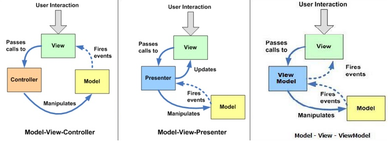

[[<<<]](README.md)

# MVC vs MVP vs MVVM
[Addy Osmani: JavaScript MV* Patterns](https://addyosmani.com/resources/essentialjsdesignpatterns/book/#detailmvcmvp)
## MVC

### Model
Models manage the data for an application. They are concerned with neither the user-interface nor presentation layers but instead represent unique forms of data that an application may require. When a model changes, it will typically notify its observers (views).
### View
View is a visual representation of our application data.
### Controller
Controller is an intermediary between view and model, classically responsible for updating the model when the user manipulates the view.

MVC Advantages:
- Easier overall maintenance. When updates need to be made to the application it is very clear whether the changes are data-centric, meaning changes to models and possibly controllers, or merely visual, meaning changes to views.
- Decoupling models and views means that it is significantly more straight-forward to write unit tests for business logic
- Duplication of low-level model and controller code (i.e what we may have been using instead) is eliminated across the application
- Depending on the size of the application and separation of roles, this modularity allows developers responsible for core logic and developers working on the user-interfaces to work simultaneously

The GoF do not refer to MVC as a design pattern, but rather consider it a set of classes to build a user interface. In their view, it's actually a variation of three classical design patterns: the Observer, Strategy and Composite patterns. Depending on how MVC has been implemented in a framework, it may also use the Factory and Template patterns.

MVC relies on the Observer pattern for some of its core communication (something that surprisingly isn't covered in many articles about the MVC pattern). When a model is changed it notifies its observers (Views) that something has been updated - this is perhaps the most important relationship in MVC.

Controllers facilitate views to respond to different user input and are an example of the Strategy pattern.

[Addy Osmani: MVC](https://addyosmani.com/resources/essentialjsdesignpatterns/book/#detailmvc)

[Wiki: MVC](https://en.wikipedia.org/wiki/Model%E2%80%93view%E2%80%93controller)

[[UP]](#)

## MVP
[Addy Osmani: MVP](https://addyosmani.com/resources/essentialjsdesignpatterns/book/#detailmvp)

[Wiki: MVP](https://en.wikipedia.org/wiki/Model%E2%80%93view%E2%80%93presenter)

[[UP]](#)

## MVVM
[Addy Osmani: MVVM](https://addyosmani.com/resources/essentialjsdesignpatterns/book/#detailmvvm)

[Wiki: MVVM](https://en.wikipedia.org/wiki/Model%E2%80%93view%E2%80%93viewmodel)

[[UP]](#)

## Comparison

Both MVP and MVVM are derivatives of MVC. The key difference between it and its derivatives is the dependency each layer has on other layers as well as how tightly bound they are to each other.

In MVC, the View sits on top of our architecture with the controller beside it. Models sit below the controller and so our Views know about our controllers and controllers know about Models. Here, our Views have direct access to Models. Exposing the complete Model to the View however may have security and performance costs, depending on the complexity of our application. MVVM attempts to avoid these issues.

In MVP, the role of the controller is replaced with a Presenter. Presenters sit at the same level as views, listening to events from both the View and model and mediating the actions between them. Unlike MVVM, there isn’t a mechanism for binding Views to ViewModels, so we instead rely on each View implementing an interface allowing the Presenter to interact with the View.

MVVM consequently allows us to create View-specific subsets of a Model which can contain state and logic information, avoiding the need to expose the entire Model to a View. Unlike MVP’s Presenter, a ViewModel is not required to reference a View. The View can bind to properties on the ViewModel which in turn expose data contained in Models to the View. As we’ve mentioned, the abstraction of the View means there is less logic required in the code behind it.

[[UP]](#)