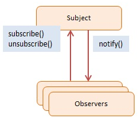
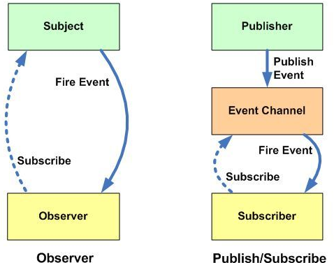
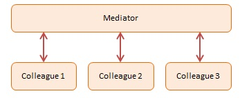

[[<<<]](README.md)

# Observer vs PubSub vs Mediator
## Observer
**Definition**: Define a one-to-many dependency between objects so that when one object changes state, all its dependents are notified and updated automatically.

**Summary**: The Observer pattern offers a subscription model in which objects subscribe to an event and get notified when the event occurs. This pattern is the cornerstone of event driven programming, including JavaScript. The Observer pattern facilitates good object-oriented design and promotes loose coupling.

When building web apps you end up writing many event handlers. Event handlers are functions that will be notified when a certain event fires. These notifications optionally receive an event argument with details about the event (for example the x and y position of the mouse at a click event).

The event and event-handler paradigm in JavaScript is the manifestation of the Observer design pattern.



The objects participating in this pattern are:

- Subject -- In sample code: Click
  - maintains list of observers. Any number of Observer objects may observe a Subject
  - implements an interface that lets observer objects subscribe or unsubscribe
  - sends a notification to its observers when its state changes
- Observers -- In sample code: clickHandler
  - has a function signature that can be invoked when Subject changes (i.e. event occurs)

The Click object represents the Subject. The clickHandler function is the subscribing Observer. This handler subscribes, unsubscribes, and then subscribes itself while events are firing. It gets notified only of events #1 and #3.

Notice that the fire method accepts two arguments. The first one has details about the event and the second one is the context, that is, the this value for when the eventhandlers are called. If no context is provided this will be bound to the global object (window).

The log function is a helper which collects and displays results.

``` javascript
function Click() {
    this.handlers = [];  // observers
}
 
Click.prototype = {
 
    subscribe: function(fn) {
        this.handlers.push(fn);
    },
 
    unsubscribe: function(fn) {
        this.handlers = this.handlers.filter(
            function(item) {
                if (item !== fn) {
                    return item;
                }
            }
        );
    },
 
    fire: function(o, thisObj) {
        var scope = thisObj || window;
        this.handlers.forEach(function(item) {
            item.call(scope, o);
        });
    }
}
 
// log helper
 
var log = (function() {
    var log = "";
 
    return {
        add: function(msg) { log += msg + "\n"; },
        show: function() { alert(log); log = ""; }
    }
})();
 
function run() {
 
    var clickHandler = function(item) { 
        log.add("fired: " + item); 
    };
 
    var click = new Click();
 
    click.subscribe(clickHandler);
    click.fire('event #1');
    click.unsubscribe(clickHandler);
    click.fire('event #2');
    click.subscribe(clickHandler);
    click.fire('event #3');
 
    log.show();
}
```


- **Subject**: maintains a list of observers, facilitates adding or removing observers
- **Observer**: provides a update interface for objects that need to be notified of a Subject's changes of state
- **ConcreteSubject**: broadcasts notifications to observers on changes of state, stores the state of ConcreteObservers
- **ConcreteObserver**: stores a reference to the ConcreteSubject, implements an update interface for the Observer to ensure state is consistent with the Subject's

``` javascript
/* ObserverList constructor */
function ObserverList(){
  this.observerList = [];
}
 
ObserverList.prototype.add = function(obj){
  return this.observerList.push(obj);
};
 
ObserverList.prototype.count = function(){
  return this.observerList.length;
};
 
ObserverList.prototype.get = function(index){
  if(index > -1 && index < this.observerList.length){
    return this.observerList[ index ];
  }
};
 
ObserverList.prototype.indexOf = function(obj, startIndex){
  var i = startIndex;
 
  while(i < this.observerList.length){
    if(this.observerList[i] === obj){
      return i;
    }
    i++;
  }
 
  return -1;
};
 
ObserverList.prototype.removeAt = function(index){
  this.observerList.splice(index, 1);
};

/* Subject constructor */
function Subject(){
  this.observers = new ObserverList();
}
 
Subject.prototype.addObserver = function(observer){
  this.observers.add(observer);
};
 
Subject.prototype.removeObserver = function(observer){
  this.observers.removeAt(this.observers.indexOf(observer, 0));
};
 
Subject.prototype.notify = function(context){
  var observerCount = this.observers.count();
  for(var i=0; i < observerCount; i++){
    this.observers.get(i).update(context);
  }
};

/* Observer constructor */
function Observer(){
  this.update = function(){
    // ...
  };
}

/* Concrete Subject */
var subject = new Subject();

/* Concrete Observer */
var observer = new Observer();
observer.update = function(context) {
    console.log('Just got notification from Subject, the context is: '+context);
}
subject.addObserver(observer);
```

[Addy Osmani: Observer](https://addyosmani.com/resources/essentialjsdesignpatterns/book/#observerpatternjavascript)
[dofactory: Observer](http://www.dofactory.com/javascript/observer-design-pattern)

[[UP]](#)

## PubSub
``` javascript
var pubsub = {};
 
(function(myObject) {
 
    // Storage for topics that can be broadcast
    // or listened to
    var topics = {};
 
    // An topic identifier
    var subUid = -1;
 
    // Publish or broadcast events of interest
    // with a specific topic name and arguments
    // such as the data to pass along
    myObject.publish = function(topic, args) {
 
        if (!topics[topic]) {
            return false;
        }
 
        var subscribers = topics[topic],
            len = subscribers ? subscribers.length : 0;
 
        while (len--) {
            subscribers[len].func(topic, args);
        }
 
        return this;
    };
 
    // Subscribe to events of interest
    // with a specific topic name and a
    // callback function, to be executed
    // when the topic/event is observed
    myObject.subscribe = function(topic, func) {
 
        if (!topics[topic]) {
            topics[topic] = [];
        }
 
        var token = (++subUid).toString();
        topics[topic].push({
            token: token,
            func: func
        });
        return token;
    };
 
    // Unsubscribe from a specific
    // topic, based on a tokenized reference
    // to the subscription
    myObject.unsubscribe = function(token) {
        for (var m in topics) {
            if (topics[m]) {
                for (var i = 0, j = topics[m].length; i < j; i++) {
                    if (topics[m][i].token === token) {
                        topics[m].splice(i, 1);
                        return token;
                    }
                }
            }
        }
        return this;
    };
}(pubsub));

// Usage
var testSubscriber = function(topics , data){
    console.log(topics + ": " + data);
};

var testSubscription = pubsub.subscribe('testTopic', testSubscriber);

pubsub.publish('testTopic', 'hello world!');
pubsub.publish('testTopic', ['test','a','b','c']);
pubsub.publish('testTopic', [{'color':'blue'},{'text':'hello'}]);

pubsub.unsubscribe(testSubscription);
```

### Differences Between The Observer And Publish/Subscribe Pattern



Whilst the Observer pattern is useful to be aware of, quite often in the JavaScript world, we'll find it commonly implemented using a variation known as the Publish/Subscribe pattern. Whilst very similar, there are differences between these patterns worth noting.

The Observer pattern requires that the observer (or object) wishing to receive topic notifications must subscribe this interest to the object firing the event (the subject).

The Publish/Subscribe pattern however uses a topic/event channel which sits between the objects wishing to receive notifications (subscribers) and the object firing the event (the publisher). This event system allows code to define application specific events which can pass custom arguments containing values needed by the subscriber. The idea here is to avoid dependencies between the subscriber and publisher.

This differs from the Observer pattern as it allows any subscriber implementing an appropriate event handler to register for and receive topic notifications broadcast by the publisher.

### Advantages

The Observer and Publish/Subscribe patterns encourage us to think hard about the relationships between different parts of our application. They also help us identify what layers containing direct relationships which could instead be replaced with sets of subjects and observers. This effectively could be used to break down an application into smaller, more loosely coupled blocks to improve code management and potentials for re-use.

Further motivation behind using the Observer pattern is where we need to maintain consistency between related objects without making classes tightly coupled. For example, when an object needs to be able to notify other objects without making assumptions regarding those objects.

Dynamic relationships can exist between observers and subjects when using either pattern. This provides a great deal of flexibility which may not be as easy to implement when disparate parts of our application are tightly coupled.

Whilst it may not always be the best solution to every problem, these patterns remain one of the best tools for designing decoupled systems and should be considered an important tool in any JavaScript developer's utility belt.

### Disadvantages

Consequently, some of the issues with these patterns actually stem from their main benefits. In Publish/Subscribe, by decoupling publishers from subscribers, it can sometimes become difficult to obtain guarantees that particular parts of our applications are functioning as we may expect.

For example, publishers may make an assumption that one or more subscribers are listening to them. Say that we're using such an assumption to log or output errors regarding some application process. If the subscriber performing the logging crashes (or for some reason fails to function), the publisher won't have a way of seeing this due to the decoupled nature of the system.

Another draw-back of the pattern is that subscribers are quite ignorant to the existence of each other and are blind to the cost of switching publishers. Due to the dynamic relationship between subscribers and publishers, the update dependency can be difficult to track.


[Addy Osmani compact PubSub implementation](https://github.com/addyosmani/pubsubz)

[[UP]](#)

## Mediator
If it appears a system has too many direct relationships between components, it may be time to have a central point of control that components communicate through instead. The Mediator promotes loose coupling by ensuring that instead of components referring to each other explicitly, their interaction is handled through this central point. This can help us decouple systems and improve the potential for component reusability.

A real-world analogy could be a typical airport traffic control system. A tower (Mediator) handles what planes can take off and land because all communications (notifications being listened out for or broadcast) are done from the planes to the control tower, rather than from plane-to-plane. A centralized controller is key to the success of this system and that's really the role a Mediator plays in software design.

**Definition**: Define an object that encapsulates how a set of objects interact. Mediator promotes loose coupling by keeping objects from referring to each other explicitly, and it lets you vary their interaction independently.

**Summary**: The Mediator pattern provides central authority over a group of objects by encapsulating how these objects interact. This model is useful for scenarios where there is a need to manage complex conditions in which every object is aware of any state change in any other object in the group.



The objects participating in this pattern are:

- Mediator -- In sample code: Chatroom
  - defines an interface for communicating with Colleague objects
  - maintains references to Colleague objects
  - manages central control over operations

- Colleagues -- In sample code: Participants
  - objects that are being mediated by the Mediator
  - each instance maintains a reference to the Mediator

In the example code we have four participants that are joining in a chat session by registering with a Chatroom (the Mediator). Each participant is represented by a Participant object. Participants send messages to each other and the Chatroom handles the routing.

``` javascript
var Participant = function(name) {
    this.name = name;
    this.chatroom = null;
};
 
Participant.prototype = {
    send: function(message, to) {
        this.chatroom.send(message, this, to);
    },
    receive: function(message, from) {
        log.add(from.name + " to " + this.name + ": " + message);
    }
};
 
var Chatroom = function() {
    var participants = {};
 
    return {
 
        register: function(participant) {
            participants[participant.name] = participant;
            participant.chatroom = this;
        },
 
        send: function(message, from, to) {
            if (to) {                      // single message
                to.receive(message, from);    
            } else {                       // broadcast message
                for (key in participants) {   
                    if (participants[key] !== from) {
                        participants[key].receive(message, from);
                    }
                }
            }
        }
    };
};
 
// log helper
 
var log = (function() {
    var log = "";
 
    return {
        add: function(msg) { log += msg + "\n"; },
        show: function() { alert(log); log = ""; }
    }
})();
 
function run() {
    var yoko = new Participant("Yoko");
    var john = new Participant("John");
    var paul = new Participant("Paul");
    var ringo = new Participant("Ringo");
 
    var chatroom = new Chatroom();
    chatroom.register(yoko);
    chatroom.register(john);
    chatroom.register(paul);
    chatroom.register(ringo);
 
    yoko.send("All you need is love.");
    yoko.send("I love you John.");
    john.send("Hey, no need to broadcast", yoko);
    paul.send("Ha, I heard that!");
    ringo.send("Paul, what do you think?", paul);
 
    log.show();
}
```

[Addy Osmani: Mediator](https://addyosmani.com/resources/essentialjsdesignpatterns/book/#mediatorpatternjavascript)

[dofactory: mediator](http://www.dofactory.com/javascript/mediator-design-pattern)

[[UP]](#)